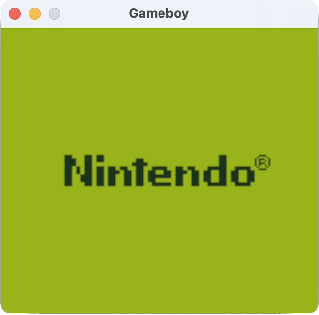
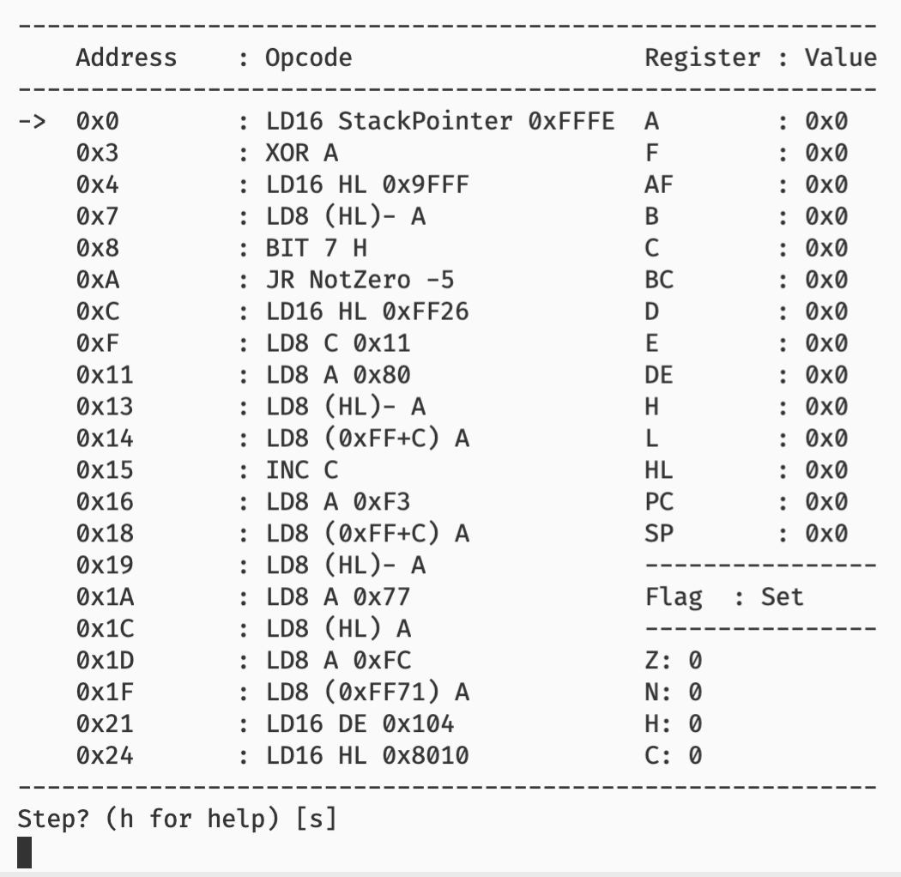

# RustGB


RustGB is a gameboy emulator written in Rust. The goal of the project is to learn how the Gameboy works while learning Rust.



## Current State :warning:

The project connect yet run any games. I am currently working through the opcode that form the bootloader while I experiment with Rust and emulator design.

## Build :hammer:

The project uses standard Rust tools so to build run the following command:

```bash
# Builds a debug build
cargo build

# To build in release mode (recommended for audio)
cargo build --release
```

If the build fails on Linux due to missing dependencies see [below](#Building-on-Linux-penguin)

## Run :running:

Run the following commands to start the emulator:

```bash
# Run in debug mode
cargo run

# Run in release mode (recommended for audio)
cargo run --release
```

## Debugger :mag_right:

The emulator also contains a partial debugger with features such as:

- Step to next instruction
- Continue
- Breakpoints
- Inspect memory
- Show Registers & Flags
- Show audio registers



To start the emulator with the debugger on run the following command:

```bash
cargo run -- -d
```

The emulator will start and pause on the first instruction. Additionally, audio output is disabled when running under the debugger.

## Resources :books:

For helpful resources I've used while developing click [here](docs/Resources.md)

## Building on Linux :penguin:

To build on Linux (tested on ubuntu) you must install some extra dependencies for the sound library. To install the dependencies run the following command for your distro:

| Distribution | Command                                                |
| ------------ | ------------------------------------------------------ |
| Debian       | `apt install -y libasound2-dev libudev-dev pkg-config` |
| Redhat       | `yum install alsa-lib-devel`                           |

## Todo :clipboard:

- [x] Clean up debug cli
- [x] Clean up opcodes directory
- [x] Debug should continue by default
- [x] Clean up PPU code
- [x] Add test for multiple shades in tile
- [x] Support palette correctly
- [x] Remove cowboy breakpoint code
- [x] Add proper debug breakpoints
- [x] Get screen scrolling working
- [x] Basic sound support
- [x] Continue adding support for bootloader commands.
- [ ] Begin implementing functionality for Tetris
- [ ] Implement interrupts
- [ ] Improve audio implementation
- [ ] Benchmark each opcode to make sure they take less time than they would on a real GB
- [ ] Fix callback system within opcodes
