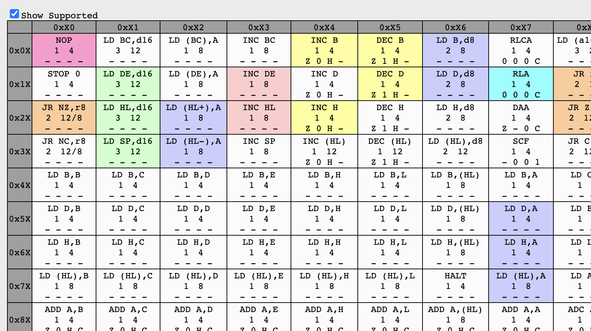

# Resources

These are some resources I've found or created to help with implementing the Gameboy.

## Pastraiser fork - https://www.guydunton.com/rust-gb/

I've forked the [pastraiser](http://www.pastraiser.com/cpu/gameboy/gameboy_opcodes.html) opcodes table which shows:

- The codes for each opcode
- The cycle time of the opcodes
- The flags which each opcodes modifies

There were a couple of errors in the main GBZ80 opcode table so I'm hosting a modified version. I've created a github action which checks which opcodes RustGB supports and highlights them in my version of the page as shown below.

## Bootstrap explanation

This site explains how the bootloader works.

https://realboyemulator.wordpress.com/2013/01/03/a-look-at-the-game-boy-bootstrap-let-the-fun-begin/

## Hardware interrupts

http://bgb.bircd.org/pandocs.htm

## Sound emulation

Sound emulation was a huge pain. Now that it is supported in RustGB I might write something to make it a little clearer.

The following pages go some way to explaining it.

- https://gbdev.gg8.se/wiki/articles/Gameboy_sound_hardware
- https://www.reddit.com/r/EmuDev/comments/5gkwi5/gb_apu_sound_emulation/
- https://aselker.github.io/gameboy-sound-chip/

